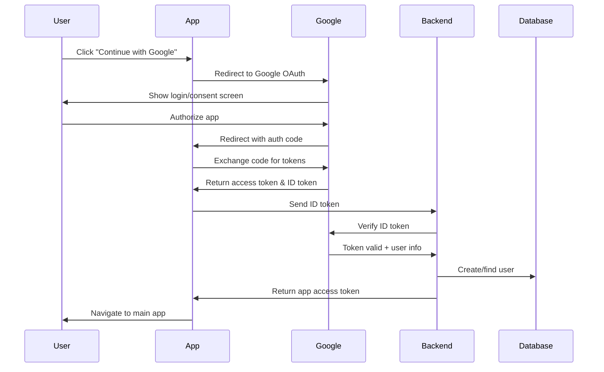

# 🔐 Google OAuth Setup Guide

Complete guide to set up Google Sign-In using Expo Auth Session.

---

## 📋 Prerequisites

- ✅ `expo-auth-session` installed
- ✅ `expo-crypto` installed  
- ✅ `expo-web-browser` installed
- ✅ Google Cloud Console account

---

## 🛠️ Step 1: Google Cloud Console Setup

### 1.1 Create a Project

1. Go to [Google Cloud Console](https://console.cloud.google.com/)
2. Click **"Select a project"** → **"New Project"**
3. Enter project name: `grad-hunter` (or your app name)
4. Click **"Create"**

### 1.2 Configure OAuth Consent Screen

1. In the left sidebar, go to **APIs & Services** → **OAuth consent screen**
2. Select **External** user type
3. Click **Create**
4. Fill in required fields:
   - **App name**: Grad Hunter
   - **User support email**: Your email
   - **Developer contact information**: Your email
5. Click **Save and Continue**
6. **Scopes**: Click **Add or Remove Scopes**
   - Select: `email`, `profile`, `openid`
   - Click **Update** → **Save and Continue**
7. **Test users** (optional for development):
   - Add your test Gmail addresses
   - Click **Save and Continue**
8. Click **Back to Dashboard**

### 1.3 Create OAuth 2.0 Credentials

#### **For Web (Required for Expo Auth Session)**

1. Go to **APIs & Services** → **Credentials**
2. Click **+ Create Credentials** → **OAuth client ID**
3. Select **Web application**
4. **Name**: `Grad Hunter Web Client`
5. **Authorized JavaScript origins**:
   ```
   http://localhost
   http://localhost:19006
   https://auth.expo.io
   ```
6. **Authorized redirect URIs**:
   ```
   https://auth.expo.io/@YOUR_EXPO_USERNAME/YOUR_APP_SLUG
   http://localhost:19006
   ```
   
   > **Important**: Replace `YOUR_EXPO_USERNAME` with your Expo username and `YOUR_APP_SLUG` with your app slug from `app.json`

7. Click **Create**
8. **Copy the Client ID** - you'll need this!

#### **For iOS (Optional - Only if building standalone iOS app)**

1. Click **+ Create Credentials** → **OAuth client ID**
2. Select **iOS**
3. **Name**: `Grad Hunter iOS`
4. **Bundle ID**: Your iOS bundle identifier from `app.json` (e.g., `com.yourcompany.gradhunter`)
5. Click **Create**
6. **Copy the Client ID**

#### **For Android (Optional - Only if building standalone Android app)**

1. Click **+ Create Credentials** → **OAuth client ID**
2. Select **Android**
3. **Name**: `Grad Hunter Android`
4. **Package name**: Your Android package name from `app.json`
5. **SHA-1 certificate fingerprint**:
   ```bash
   # For debug builds:
   keytool -keystore ~/.android/debug.keystore -list -v
   # Password: android
   ```
6. Click **Create**
7. **Copy the Client ID**

---

## 🔧 Step 2: Configure Your Expo App

### 2.1 Update `app.json`

Add your app scheme:

```json
{
  "expo": {
    "scheme": "gradhunter",
    "slug": "grad-hunter",
    "name": "Grad Hunter",
    // ... other config
  }
}
```

### 2.2 Create `.env` File

Create a file named `.env` in your `frontend` folder:

```env
# Google OAuth Client IDs
EXPO_PUBLIC_GOOGLE_WEB_CLIENT_ID=YOUR_WEB_CLIENT_ID.apps.googleusercontent.com
EXPO_PUBLIC_GOOGLE_IOS_CLIENT_ID=YOUR_IOS_CLIENT_ID.apps.googleusercontent.com
EXPO_PUBLIC_GOOGLE_ANDROID_CLIENT_ID=YOUR_ANDROID_CLIENT_ID.apps.googleusercontent.com
```

**Replace** with your actual Client IDs from Google Cloud Console.

### 2.3 Update `config/google.ts`

The file is already configured to use environment variables:

```typescript
export const GoogleConfig = {
  webClientId: process.env.EXPO_PUBLIC_GOOGLE_WEB_CLIENT_ID || 'YOUR_GOOGLE_WEB_CLIENT_ID.apps.googleusercontent.com',
  iosClientId: process.env.EXPO_PUBLIC_GOOGLE_IOS_CLIENT_ID || '',
  androidClientId: process.env.EXPO_PUBLIC_GOOGLE_ANDROID_CLIENT_ID || '',
};
```

If you don't want to use `.env`, you can hardcode the values directly.

---

## 📱 Step 3: Update Backend

Your backend needs to verify the Google ID token and create/login users.

### 3.1 Backend Endpoint

The frontend sends a request to `/auth/google` with the Google ID token:

```javascript
// POST /auth/google
{
  "idToken": "google_id_token_here"
}
```

### 3.2 Backend Implementation

You already have a Google auth controller in `backend/controllers/Auth/googleAuth.js`. Make sure it:

1. **Verifies the ID token** with Google
2. **Extracts user info** (email, name, Google ID)
3. **Checks if user exists** in your database
4. **Creates new user** if doesn't exist
5. **Returns access token** and user data

Example flow:

```javascript
const { OAuth2Client } = require('google-auth-library');
const client = new OAuth2Client(process.env.GOOGLE_CLIENT_ID);

async function verifyGoogleToken(idToken) {
  const ticket = await client.verifyIdToken({
    idToken: idToken,
    audience: process.env.GOOGLE_CLIENT_ID,
  });
  return ticket.getPayload();
}

// In your controller
const payload = await verifyGoogleToken(req.body.idToken);
// payload contains: email, name, sub (Google ID), picture, etc.
```

---

## 🧪 Step 4: Testing

### 4.1 Test in Expo Go (Web Browser Flow)

1. Start your app:
   ```bash
   cd frontend
   npm start
   ```

2. Press **'w'** to open in web browser
3. Click **"Continue with Google"**
4. You'll be redirected to Google login
5. After authorization, you'll be redirected back to your app

### 4.2 Test on Mobile Device

1. Start your app and scan QR with Expo Go
2. Click **"Continue with Google"**
3. Opens browser for authentication
4. After success, returns to Expo Go

### 4.3 Common Issues

**Issue**: "redirect_uri_mismatch"
- **Fix**: Add the exact redirect URI shown in the error to your Google Console authorized redirect URIs

**Issue**: "access_denied"
- **Fix**: Make sure you added your email as a test user in OAuth consent screen

**Issue**: Button is disabled
- **Fix**: Check that `EXPO_PUBLIC_GOOGLE_WEB_CLIENT_ID` is set correctly

---

## 🎯 Step 5: Production Deployment

### 5.1 Update Redirect URIs for Production

When you deploy your app, add production redirect URIs to Google Console:

```
https://your-production-domain.com
https://auth.expo.io/@YOUR_EXPO_USERNAME/YOUR_APP_SLUG
```

### 5.2 Environment Variables

For production, use Expo's environment variables:

```bash
# Set production environment variables
npx expo config --type prebuild
```

Or use EAS Build secrets:

```bash
eas secret:create --scope project --name EXPO_PUBLIC_GOOGLE_WEB_CLIENT_ID --value "your-client-id"
```

---

## 📖 How It Works

### Authentication Flow



### Key Points

1. **Frontend**: Uses `expo-auth-session` for browser-based OAuth flow
2. **Google**: Provides ID token after user authorizes
3. **Backend**: Verifies ID token and creates/authenticates user
4. **App**: Stores access token and user data locally

---

## 🔒 Security Best Practices

1. ✅ **Never** hardcode Client IDs in public repositories
2. ✅ **Always** verify ID tokens on the backend
3. ✅ **Use** HTTPS in production redirect URIs
4. ✅ **Store** tokens securely (we use SecureStore)
5. ✅ **Implement** token refresh logic
6. ✅ **Add** rate limiting on backend auth endpoints

---

## 📚 Additional Resources

- **Expo Auth Session Docs**: https://docs.expo.dev/versions/latest/sdk/auth-session/
- **Google OAuth 2.0**: https://developers.google.com/identity/protocols/oauth2
- **Google Sign-In for Web**: https://developers.google.com/identity/gsi/web
- **Expo Authentication Guide**: https://docs.expo.dev/guides/authentication/

---

## ✅ Checklist

Before going live, make sure:

- [ ] Google Cloud project created
- [ ] OAuth consent screen configured
- [ ] Web OAuth client ID created
- [ ] Redirect URIs added to Google Console
- [ ] Environment variables set (`.env` file)
- [ ] Backend `/auth/google` endpoint implemented
- [ ] Backend verifies Google ID tokens
- [ ] Tested on web browser
- [ ] Tested in Expo Go on mobile
- [ ] Production redirect URIs configured
- [ ] Security best practices followed

---

## 🆘 Troubleshooting

### Error: "Invalid Client"

**Cause**: Client ID is incorrect or not found.

**Solution**:
1. Check `EXPO_PUBLIC_GOOGLE_WEB_CLIENT_ID` in `.env`
2. Verify it matches the Client ID from Google Console
3. Restart the Expo dev server after changing `.env`

### Error: "redirect_uri_mismatch"

**Cause**: The redirect URI is not authorized in Google Console.

**Solution**:
1. Copy the exact redirect URI from the error message
2. Add it to **Authorized redirect URIs** in Google Console
3. Try again (may take a few minutes to propagate)

### Button is Disabled / Not Clickable

**Cause**: OAuth request not initialized.

**Solution**:
1. Check console for errors
2. Verify Client ID is set correctly
3. Make sure `expo-auth-session` is installed
4. Restart the app

### Backend Error: "Invalid ID Token"

**Cause**: Backend can't verify the token.

**Solution**:
1. Install `google-auth-library` in backend:
   ```bash
   npm install google-auth-library
   ```
2. Make sure backend uses the same Client ID
3. Check that ID token hasn't expired

---

## 🎉 Success!

Once configured, users can:
- ✅ Sign in with their Google account
- ✅ No password required
- ✅ Fast and secure authentication
- ✅ Automatic account creation

Your Google Sign-In is now ready! 🚀
